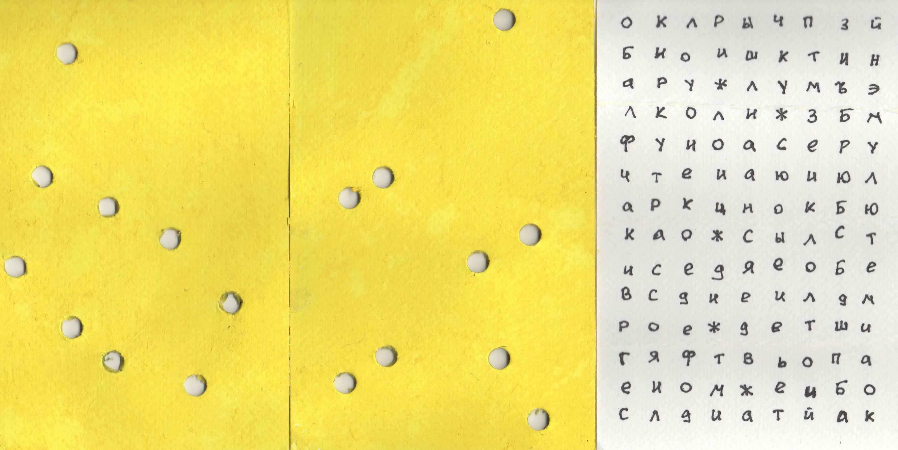

# Декодер для Аниных подсказок

[](LICENSE)




Программа работает с двумя листами:

- первый содержит набор букв (данные),
- второй представляет собой шаблон с вырезанными отверстиями.

Ориентация шаблона заранее неизвестна, как и правила совмещения и считывания.
Задача — определить правильное наложение, при котором через отверстия шаблона можно прочитать скрытое сообщение.


## Найденные ренения

```
                        П        
                                 
                                 
                                 
                                 
        Е                        
    Р                            
                            С    
                    Е            
                                 
                                 
        Ф               О        
    Н                            
                            А    
---
ПЕРСЕФОНА
РНЕФЕПОСА
```

```
                                 
        О                        
                                 
                                 
                                 
    Т                            
            Ц                    
                    Ы            
И                                
                            Д    
        Е                        
            Т                    
                        И        
                                 
---
ОТЦЫИДЕТИ
ИТОЕЦТЫИД
```

## Пример использования

```php

$data = new Data("
ОКЛРЫЧПЗЙ
БИОИШКТИН
АРУЖЛУМЪЭ
ЛКОЛИЖЗБМ
ФУИОАСЕРУ
ЧТЕИАЮИЮЛ
АРКЦНОКБЮ
КАОЖСЫЛСТ
ИСЕДЯЕОБЕ
ВСДИЕИЛДМ
РОЕЖДЕТШИ
ГЯФТВЬОПА
ЕНОМЖЕИБО
СЛДИАТЙАК
");


$mask = new Mask("
______O__
_________
_________
_________
_________
__O______
_O_______
_______O_
_____O___
_________
_________
__O___O__
_O_______
_______O_
");


Uncrypter::renderAllIfAllHolesHaveSymbols(
    $data, 
    $mask
);
```